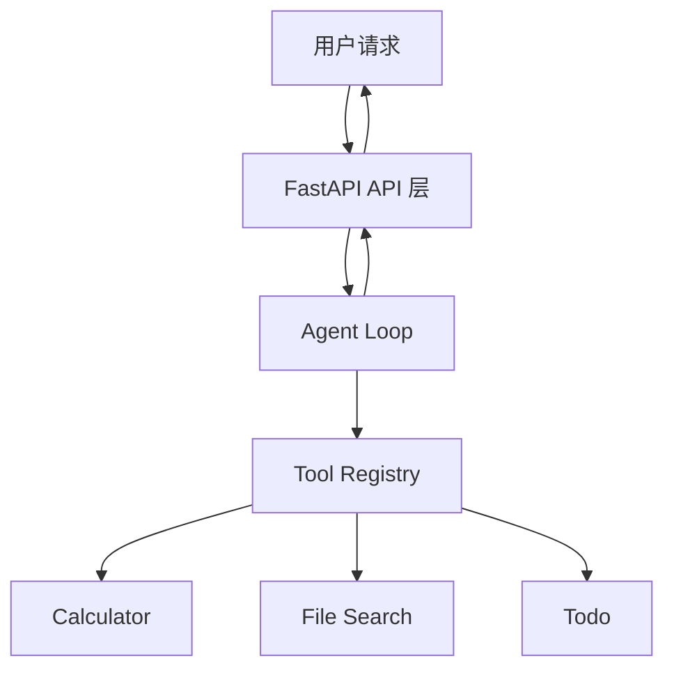

# 子模块 7：日志、配置、Docker 与 README 概念教学

## 1. 本子模块的学习目标

子模块 7 是模块 1 的最后一个子模块。

前面我们已经完成了：

- LLM API 与对话结构。
- Structured Output 与 Pydantic 校验。
- Tool Calling 与工具层设计。
- 手写最小 Agent Loop。
- FastAPI 服务化。
- 测试、Mock 与覆盖率。

子模块 7 的目标是给项目补上“工程外壳”。

所谓工程外壳，指的是让一个项目不只是代码能跑，而是：

- 新环境能复现。
- 配置能管理。
- 日志能排查问题。
- Docker 能统一运行方式。
- README 能让别人快速理解项目。

一句话概括：

这个子模块要把 `mini-tool-agent` 从“我自己能跑”推进到“别人也能看懂、运行、测试和评估”。

## 2. 为什么最后要做工程外壳

很多学习项目的问题不是代码完全不能用，而是别人无法顺利复现。

常见情况包括：

- API key 写在代码里，不能提交。
- 运行命令只存在作者脑子里。
- 环境变量没有示例。
- 日志只打印一两句，看不出请求过程。
- 工具失败后不知道哪个环节坏了。
- 新机器上依赖装不起来。
- README 只有一句“这是一个 Agent 项目”。

这些问题会让项目很难展示，也很难继续维护。

所以子模块 7 关注的是项目可交付性。

## 3. 什么是配置管理

配置管理是指把会随环境变化的参数，从代码中抽离出来，用统一方式读取和管理。

例如下面这些不应该写死在业务代码里：

- API key。
- 模型名称。
- LLM base URL。
- 最大 Agent 步数。
- 日志级别。
- 文件搜索根目录。
- 服务名称。
- 运行环境。
- 工具超时时间。

如果写死在代码里，会有几个问题：

- 本地、测试、生产环境无法灵活切换。
- 敏感信息可能被提交到仓库。
- 修改配置需要改代码。
- 测试时很难覆盖不同配置。

更好的做法是：

```text
.env / 环境变量
  -> Settings
  -> 应用状态
  -> 各模块使用自己需要的配置
```

## 4. `.env` 与 `.env.example`

`.env` 是本地真实环境变量文件。

例如：

```env
APP_NAME=mini-tool-agent
APP_ENV=development
LOG_LEVEL=INFO
LLM_API_KEY=real_key_here
```

`.env.example` 是示例文件。

它告诉别人需要哪些配置，但不包含真实密钥。

例如：

```env
APP_NAME=mini-tool-agent
APP_ENV=development
LOG_LEVEL=INFO
LLM_API_KEY=your_api_key_here
```

区别：

- `.env`：本地真实配置，不应该提交。
- `.env.example`：配置模板，可以提交。

子模块 7 的最低要求之一就是 `.env.example`。

## 5. API key 为什么不能入库

API key 是访问模型服务或第三方服务的凭证。

如果 API key 被提交到 Git 仓库，可能产生严重后果：

- 被别人盗用。
- 产生费用。
- 访问权限泄露。
- 密钥需要紧急轮换。

所以需要确保：

- `.env` 写入 `.gitignore`。
- 代码中不硬编码 API key。
- README 中只展示变量名，不展示真实值。
- 日志中不要打印 API key。
- 错误响应中不要泄露 API key。

## 6. 什么应该配置化

学习路线要求至少配置：

- 模型名称。
- 最大轮数。
- 日志级别。

在当前 Agent 项目中，还可以配置：

- `APP_NAME`
- `APP_ENV`
- `APP_DEBUG`
- `LOG_LEVEL`
- `FILE_SEARCH_ROOT`
- `MAX_FILE_SEARCH_RESULTS`
- `MAX_AGENT_STEPS`
- `LLM_MODEL`
- `LLM_BASE_URL`
- `LLM_TEMPERATURE`
- `LLM_MAX_TOKENS`
- 工具超时时间。
- 计算器最大幂指数。
- CORS origins。

配置项不是越多越好。

判断一个值是否应该配置化，可以问：

- 它是否不同环境会不同？
- 它是否可能被运维或使用者调整？
- 它是否涉及安全或性能限制？
- 修改它是否不应该重新发版？

如果答案是“是”，就适合配置化。

## 7. Settings 对象

Settings 对象是配置管理的中心。

它的职责是：

- 从环境变量读取值。
- 提供默认值。
- 做类型转换。
- 提供给应用其他模块使用。

例如：

```python
@dataclass(frozen=True)
class Settings:
    app_name: str = "mini-tool-agent"
    environment: str = "development"
    log_level: str = "INFO"
    max_agent_steps: int = 4
```

一个常见原则是：

不要让每个工具、路由或业务函数到处直接 `os.getenv()`。

更推荐：

```text
Settings.from_env()
  -> AppState
  -> Tool / Agent / API
```

这样配置入口集中，测试也更容易。

## 8. 工具配置如何组织

当工具配置越来越多时，不建议这样写：

```python
CalculatorTool(
    max_power_exponent=settings.calculator_max_power_exponent,
    max_expression_length=settings.calculator_max_expression_length,
    allow_float=settings.calculator_allow_float,
)
```

参数太多会让构造函数难读，也容易传错。

更推荐给工具单独建配置对象：

```python
@dataclass(frozen=True)
class CalculatorSettings:
    max_power_exponent: int = 8
    max_expression_length: int = 120
    allow_float: bool = True
```

然后：

```python
CalculatorTool(settings.tools.calculator)
```

原则：

工具应该依赖“自己需要的配置对象”，而不是依赖整个应用配置。

这样工具更独立，更容易测试，也更容易复用。

## 9. 什么是日志

日志是程序运行时记录下来的事件。

它回答的问题是：

- 谁发起了请求？
- 请求什么时候开始？
- 选择了哪个工具？
- 工具参数是什么？
- 工具运行了多久？
- 工具是否失败？
- 最终状态是什么？

在 Agent 项目中，日志尤其重要。

因为一次 `/chat` 请求可能经过：

```text
API 请求
  -> Agent 规划
  -> 工具选择
  -> 工具执行
  -> 工具结果
  -> 最终回答
```

如果没有日志，请求失败时只能靠猜。

## 10. 什么是结构化日志

普通日志可能是这样：

```text
工具调用成功
```

这句话人能看，但机器很难筛选。

结构化日志会把信息拆成字段：

```json
{
  "event": "tool_call_finished",
  "trace_id": "trace_abc123",
  "tool_name": "calculator",
  "latency_ms": 12,
  "status": "success"
}
```

结构化日志的好处是：

- 可以按 `trace_id` 搜索。
- 可以按 `tool_name` 聚合。
- 可以统计工具耗时。
- 可以过滤失败请求。
- 适合接入日志平台。

学习阶段不一定要接日志平台，但应该开始按结构化思路写日志。

## 11. Trace ID

trace id 是一次请求的唯一标识。

它的作用是把一次请求中的所有日志串起来。

例如：

```text
trace_id=trace_abc123 request_started
trace_id=trace_abc123 tool_selected calculator
trace_id=trace_abc123 tool_finished success
trace_id=trace_abc123 request_finished success
```

没有 trace id 时，多用户并发请求的日志会混在一起，很难复盘。

子模块 7 要求日志能复盘一次完整工具调用，而 trace id 是实现这个目标的关键。

## 12. User Message 摘要

日志中可以记录用户消息摘要，但不建议直接记录完整用户输入。

原因：

- 用户输入可能包含隐私。
- 输入可能很长。
- 日志体积会膨胀。
- 真实项目可能有合规要求。

更安全的做法是：

- 记录长度。
- 记录截断摘要。
- 必要时记录 hash。

例如：

```json
{
  "event": "request_started",
  "trace_id": "trace_abc123",
  "message_preview": "帮我计算 3 *...",
  "message_length": 18
}
```

## 13. 工具日志应该记录什么

学习路线要求结构化日志包含：

- trace id。
- user message 摘要。
- selected tool。
- tool arguments。
- tool latency。
- tool error。
- final status。

可以理解为三个阶段。

### 13.1 请求开始

记录：

- `event=request_started`
- `trace_id`
- `message_preview`
- `message_length`

### 13.2 工具调用

记录：

- `event=tool_call_started`
- `trace_id`
- `tool_name`
- `tool_arguments`

### 13.3 工具完成

记录：

- `event=tool_call_finished`
- `trace_id`
- `tool_name`
- `latency_ms`
- `status`
- `error_code`
- `error_message`

### 13.4 请求结束

记录：

- `event=request_finished`
- `trace_id`
- `final_status`
- `used_tools`

## 14. 日志中的敏感信息

日志不是越多越好。

不应该直接写入日志的内容包括：

- API key。
- 完整用户隐私输入。
- 文件系统敏感路径。
- 完整异常栈返回给用户。
- 大段模型输出。
- 账号、密码、token。

异常栈可以进入服务日志，但不应该进入 API 响应。

这也是为什么普通 `/chat` 和 `/chat/stream` 的错误响应都应该保持克制。

## 15. 日志级别

常见日志级别：

- `DEBUG`：调试细节。
- `INFO`：正常关键事件。
- `WARNING`：异常但还能继续。
- `ERROR`：请求失败或功能失败。
- `CRITICAL`：严重故障。

学习项目中可以这样使用：

- 请求开始、请求结束：`INFO`
- 工具调用开始、完成：`INFO`
- 参数校验失败：`WARNING`
- 工具执行失败：`ERROR`
- 未处理异常：`ERROR`

日志级别应该可配置，例如：

```env
LOG_LEVEL=INFO
```

## 16. 什么是 Docker

Docker 是一种容器化工具。

它可以把应用和运行环境打包到一个镜像中。

这样别人不需要手动猜：

- Python 版本。
- 依赖怎么安装。
- 服务怎么启动。
- 环境变量怎么传。

Docker 的目标是让运行方式可复现。

## 17. Docker 镜像与容器

镜像可以理解为应用运行环境的模板。

容器是镜像运行起来后的实例。

类比：

```text
Dockerfile -> image -> container
```

例如：

```bash
docker build -t mini-tool-agent .
docker run -p 8000:8000 mini-tool-agent
```

第一条命令构建镜像。

第二条命令启动容器。

## 18. Dockerfile

Dockerfile 是构建镜像的说明书。

一个简化例子：

```dockerfile
FROM python:3.11-slim

WORKDIR /app

COPY pyproject.toml ./
RUN pip install .

COPY . .

CMD ["uvicorn", "app.main:app", "--host", "0.0.0.0", "--port", "8000"]
```

真实项目中还需要考虑：

- 依赖安装方式。
- 缓存层。
- 是否复制 `.env`。
- 是否排除 `.venv`。
- 是否使用非 root 用户。
- 镜像体积。

学习阶段先保证能构建并启动 API。

## 19. `.dockerignore`

`.dockerignore` 用来告诉 Docker 构建镜像时忽略哪些文件。

常见内容：

```text
.venv
__pycache__
.pytest_cache
.env
.git
htmlcov
```

为什么需要它？

- 避免把本地虚拟环境复制进镜像。
- 避免把 `.env` 中的密钥打进镜像。
- 加快构建速度。
- 减小镜像体积。

## 20. docker-compose

`docker-compose.yml` 用来描述多容器服务。

本项目目前只有一个 API 服务，所以 compose 是可选的。

但如果未来增加：

- 数据库。
- Redis。
- 前端。
- 日志服务。

compose 就会很有用。

一个简化例子：

```yaml
services:
  api:
    build: .
    ports:
      - "8000:8000"
    env_file:
      - .env
```

子模块 7 要求 Dockerfile 必须有，docker-compose 可选。

## 21. Docker 与 `.env`

Docker 运行时也需要配置。

常见方式：

```bash
docker run --env-file .env -p 8000:8000 mini-tool-agent
```

注意：

- `.env` 不应该复制进镜像。
- `.env` 应该在运行容器时传入。
- 镜像应该只包含代码和依赖，不包含真实密钥。

## 22. 什么是 README

README 是项目的说明书。

它应该回答：

- 这个项目是什么？
- 解决什么问题？
- 怎么启动？
- 怎么测试？
- 有哪些 API？
- 有哪些工具？
- 架构是什么？
- 有哪些限制？
- 下一步怎么扩展？

对子模块 7 来说，README 不是“可有可无的文档”，而是项目交付的一部分。

## 23. README 为什么重要

学习路线的验收标准说：

README 能让面试官在 3 分钟内看懂项目价值。

这句话很重要。

如果别人打开项目后 3 分钟内看不懂：

- 你做了什么。
- 项目怎么跑。
- 技术亮点在哪里。
- 如何验证功能。

那项目展示效果就会大打折扣。

README 不是写给作者自己的，而是写给第一次看到项目的人。

## 24. README 应该包含什么

学习路线要求 README 包含：

- 项目背景。
- 架构图或流程图。
- 快速启动。
- API 示例。
- 工具列表。
- 测试方式。
- 已知限制。
- 下一步计划。

可以组织成：

```text
1. 项目简介
2. 功能特性
3. 架构图
4. 快速开始
5. 配置说明
6. API 示例
7. 工具列表
8. 测试方式
9. Docker 运行
10. 日志说明
11. 已知限制
12. 下一步计划
```

## 25. 架构图或流程图

README 中可以使用 Mermaid 画流程图。

例如：



架构图不需要复杂，但要帮助读者快速理解系统。

## 26. 快速启动

快速启动应该尽量短。

例如：

```bash
uv sync
copy .env.example .env
uvicorn app.main:app --reload
```

或者 Docker：

```bash
docker build -t mini-tool-agent .
docker run --env-file .env -p 8000:8000 mini-tool-agent
```

快速启动的目标是让新用户少猜。

## 27. API 示例

README 中应该给出可复制的 API 示例。

例如：

```bash
curl http://127.0.0.1:8000/health
```

```bash
curl -X POST http://127.0.0.1:8000/chat \
  -H "Content-Type: application/json" \
  -d '{"message":"计算 3 * (4 + 5)"}'
```

API 示例应该覆盖：

- `/health`
- `/tools`
- `/chat`
- `/chat/stream`

## 28. 工具列表

README 中应该说明项目有哪些工具。

例如：

| 工具 | 作用 | 说明 |
|---|---|---|
| calculator | 数学计算 | 使用 AST 白名单，避免直接 eval |
| file_search | 文件搜索 | 在限定目录内搜索 |
| todo | 待办事项 | 按 session_id 隔离 |
| web_summary_mock | 网页摘要 mock | 不访问真实网络，适合测试 |

工具列表可以帮助读者理解 Agent 的能力边界。

## 29. 测试方式

README 中应该写清楚如何运行测试。

例如：

```bash
pytest
```

如果有覆盖率：

```bash
pytest --cov=app --cov-report=term-missing
```

还应该说明测试特点：

- 大部分测试不调用真实模型。
- 使用 mock 或规则型 planner。
- API 测试使用 FastAPI TestClient。

## 30. 已知限制

已知限制不是扣分项。

相反，写清楚限制说明你理解项目边界。

例如：

- 当前 planner 是规则型 mock，不是真实 LLM planner。
- `web_summary_mock` 不访问真实网络。
- `todo` 使用内存存储，服务重启后数据丢失。
- 没有用户认证。
- Docker 镜像只用于本地学习运行。
- streaming 错误处理还可以继续增强。

## 31. 下一步计划

下一步计划可以包括：

- 接入真实 LLM planner。
- 增加工具超时控制。
- 增加结构化 JSON 日志。
- 将 TodoStore 替换为 SQLite。
- 增加 CORS。
- 增加 CI。
- 增加部署说明。

下一步计划的价值是展示你知道项目如何继续演进。

## 32. 一次完整请求如何复盘

子模块 7 的验收标准之一是：

日志能复盘一次完整工具调用。

这意味着给定一个 `trace_id`，你应该能看到：

```text
request_started
agent_plan_created
tool_call_started
tool_call_finished
request_finished
```

如果工具失败，应能看到：

```text
request_started
agent_plan_created
tool_call_started
tool_call_failed
request_finished
```

复盘的关键字段：

- `trace_id`
- `event`
- `tool_name`
- `tool_arguments`
- `latency_ms`
- `status`
- `error_code`

## 33. 本阶段验收标准

学习路线给出的验收标准是：

- 新环境可以根据 README 启动服务。
- 日志能复盘一次完整工具调用。
- README 能让面试官在 3 分钟内看懂项目价值。

可以进一步拆成：

- `.env.example` 包含必要配置项。
- `.env` 没有被提交。
- 模型名称、最大轮数、日志级别可配置。
- 工具调用有结构化日志。
- 工具失败有错误日志。
- Dockerfile 可以构建镜像。
- 本地可以通过 Docker 启动 API。
- README 有架构图、API 示例、测试方式和已知限制。

## 34. 学习后的自检问题

完成本子模块概念学习后，可以尝试回答：

1. 为什么 API key 不能写进代码？
2. `.env` 和 `.env.example` 有什么区别？
3. 为什么不建议到处直接 `os.getenv()`？
4. 什么样的值应该配置化？
5. 结构化日志和普通文本日志有什么区别？
6. trace id 解决了什么问题？
7. 工具调用日志应该记录哪些字段？
8. 为什么日志中不能无脑记录完整用户输入？
9. Dockerfile 的作用是什么？
10. `.dockerignore` 为什么重要？
11. Docker 镜像和容器有什么区别？
12. README 为什么属于工程交付的一部分？
13. README 的“已知限制”为什么不是坏事？
14. 如何判断别人能不能根据 README 复现项目？
15. 如果让面试官 3 分钟理解项目，你会把哪些内容放在 README 最前面？

## 35. 下一步实践方向

接下来做练习时，可以按下面顺序推进：

1. 检查 `.env.example` 是否包含必要配置。
2. 检查 `.gitignore` 是否排除了 `.env`、缓存、覆盖率报告等文件。
3. 为工具调用增加结构化日志。
4. 在日志中加入 trace id、工具名称、耗时和状态。
5. 编写 Dockerfile。
6. 编写 `.dockerignore`。
7. 可选编写 `docker-compose.yml`。
8. 更新 README，加入架构图、启动方式、API 示例、测试方式、限制和下一步计划。
9. 在本地按 README 从零走一遍启动流程。
10. 用一次 `/chat` 请求检查日志是否能完整复盘工具调用。

