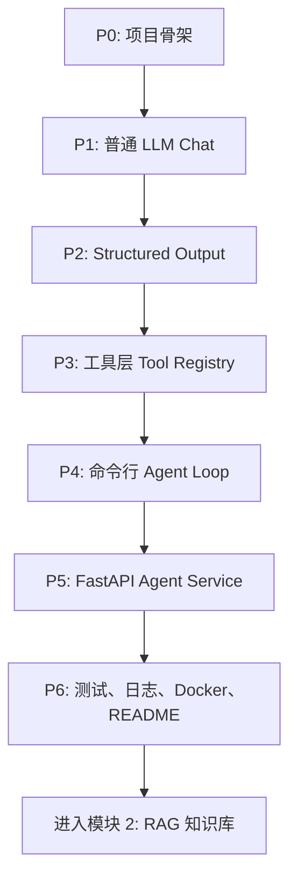

# 模块 1：LLM 工程基础与最小 Agent 详细学习路线

生成日期：2026-05-18  
对应主文档：`documents/AI_Agent_学习路径_硕士一年级到求职.md` 的第 16 节  
阶段定位：模块 1，LLM 工程基础与最小 Agent  
建议周期：5 到 6 周  
建议有效投入：每周 22 到 28 小时  
核心项目：`mini-tool-agent`

---

## 1. 阶段总目标

这个阶段不是重新学习 Python 或 Web 入门，而是把你已有的 Django、Vue、部署经验迁移到 LLM 应用工程中。

完成本阶段后，你应该能够：

1. 不依赖 LangChain、LangGraph 等 agent 框架，手写一个可运行的最小 agent loop。
2. 理解并实现 tool calling、structured output、Pydantic 参数校验、失败重试和最大轮数控制。
3. 将 agent 包装成 FastAPI 服务，提供 `/chat`、`/tools`、`/health` 等接口。
4. 为工具、agent loop 和 API 编写 pytest 测试。
5. 使用结构化日志记录模型请求、工具调用、错误、耗时和最终响应。
6. 用 Docker 或本地脚本让项目可以被别人复现启动。
7. 写出一份能展示工程思路的 README。

阶段完成物：

- 一个可运行仓库：`mini-tool-agent`
- 一份项目 README
- 一份最小 API 文档
- 一组 pytest 测试
- 一份学习复盘笔记：《我如何从零实现一个最小 AI Agent》

---

## 2. 本阶段能力拆解

### 子模块 1：LLM API 与对话结构

学习目标：

- 理解一次 LLM 请求的基本结构。
- 区分 system、developer、user、assistant、tool 等消息角色。
- 理解 temperature、max tokens、streaming、上下文长度、token 成本。
- 能写出稳定、可控、可调试的 prompt。

需要掌握：

- 模型客户端初始化
- 环境变量管理
- 普通聊天请求
- 流式输出
- prompt 模板
- 简单错误处理

小练习：

1. 写一个 `ask_llm.py`，从命令行读取用户输入并返回回答。
2. 增加 system prompt，让模型固定以“技术助教”的身份回答。
3. 增加 temperature 对比实验，记录同一个问题在不同参数下的稳定性差异。
4. 增加 streaming 输出，观察普通输出和流式输出的体验差异。

验收标准：

- 能解释一次 LLM 请求中每个字段的作用。
- 能说明为什么工程项目中不能只依赖自然语言 prompt 控制输出。
- 能通过 `.env` 或环境变量配置 API key，而不是写死在代码里。

---

### 子模块 2：Structured Output 与 Pydantic 校验

学习目标：

- 让模型输出结构化结果，而不是不可控自然语言。
- 用 Pydantic 对模型输出进行校验。
- 学会处理 JSON 解析失败、字段缺失、类型错误。

需要掌握：

- JSON schema
- Pydantic `BaseModel`
- 字段约束
- 输出解析
- 校验失败重试
- 错误消息设计

小练习：

1. 让模型把用户任务解析成：
   - `intent`
   - `arguments`
   - `confidence`
   - `need_tool`
2. 定义对应的 Pydantic model。
3. 故意构造 5 个错误输出样例，测试解析器是否能报出清晰错误。
4. 增加一次重试逻辑：模型第一次输出不合法时，把错误反馈给模型重新生成。

验收标准：

- 能解释“结构化输出”和“普通文本输出”的差异。
- 能说明 Pydantic 在 agent 工程中的价值。
- 至少有 5 个关于输出解析的单元测试。

---

### 子模块 3：Tool Calling 与工具层设计

学习目标：

- 理解 agent 调用工具的基本过程。
- 设计工具 schema、参数校验、工具执行和工具返回。
- 将每个工具封装成可测试、可替换的 Python 函数或类。

本阶段必须实现 4 类工具：

1. 计算器工具
   - 支持加减乘除、括号、简单数学表达式。
   - 禁止执行任意 Python 代码。

2. 文件检索工具
   - 在指定目录内搜索 `.md` 或 `.txt` 文件。
   - 返回文件名、匹配行、上下文片段。
   - 不允许越权读取项目目录外文件。

3. 网页摘要 mock 工具
   - 暂时不接真实浏览器。
   - 给定 URL，返回预设摘要或 mock 数据。
   - 目的是练习外部工具返回结构。

4. 待办事项管理工具
   - 支持新增、查看、完成任务。
   - 初期可以使用本地 JSON 文件或内存存储。
   - 后续可替换为 SQLite。

建议工具接口：

```python
class ToolResult(BaseModel):
    ok: bool
    content: str
    data: dict | None = None
    error: str | None = None
```

验收标准：

- 每个工具都有独立测试。
- 每个工具都有清晰的输入 model 和输出 model。
- 工具失败时不会让整个 agent 直接崩溃。
- 能通过 `/tools` 或命令行列出当前可用工具。

---

### 子模块 4：手写最小 Agent Loop

学习目标：

- 从“调用一次 LLM”升级为“模型能观察、决策、调用工具、整合结果”。
- 理解最小 agent loop 的控制边界。

核心流程：

```text
user input
-> build messages
-> model decides whether to call a tool
-> validate tool arguments
-> execute tool
-> append tool result to messages
-> model decides next step
-> repeat until final answer or max rounds
```

必须实现：

- 最大循环轮数，例如 `max_steps=5`
- 工具白名单
- 工具参数校验
- 工具异常捕获
- 模型输出解析失败处理
- 最终回答生成
- 结构化日志

不建议本阶段做：

- 多 agent 协作
- 长期记忆
- 复杂规划器
- 接真实浏览器自动化
- 过早引入 LangGraph

小项目：命令行版 `mini-tool-agent`

功能要求：

- 用户可以在命令行输入自然语言任务。
- agent 可以选择调用计算器、文件检索、网页摘要 mock、待办事项工具。
- 终端输出最终回答。
- 日志记录每一步 tool call。

示例任务：

- “帮我计算 19 * 23 + 7。”
- “搜索 notes 目录里有没有提到 RAG evaluation。”
- “给我总结一下这个网页：https://example.com/agent-intro。”
- “添加一个待办：周五整理 mini-tool-agent README。”

验收标准：

- 至少 8 个端到端测试或集成测试。
- 能演示一次包含 2 次工具调用的任务。
- 能解释 agent loop 为什么需要最大轮数。
- 能说明什么时候应该让模型决策，什么时候应该写确定性代码。

---

### 子模块 5：FastAPI 服务化

学习目标：

- 把命令行 agent 包装成可被前端或其他服务调用的 API。
- 建立基本后端工程结构。

建议目录结构：

```text
mini-tool-agent/
  app/
    main.py
    api/
      routes.py
      schemas.py
    agent/
      loop.py
      prompts.py
      models.py
    tools/
      base.py
      calculator.py
      file_search.py
      web_summary_mock.py
      todo.py
    core/
      config.py
      logging.py
      errors.py
  tests/
    test_tools_calculator.py
    test_tools_file_search.py
    test_agent_loop.py
    test_api_chat.py
  .env.example
  README.md
  pyproject.toml
```

必须提供的接口：

1. `GET /health`
   - 返回服务状态。

2. `GET /tools`
   - 返回工具名称、描述、参数 schema。

3. `POST /chat`
   - 输入用户消息。
   - 返回最终回答、使用过的工具、trace id。

4. `POST /chat/stream`，可选
   - 用于练习 streaming。
   - 如果时间紧，可以放到本阶段后半段或下一轮优化。

验收标准：

- API 请求和响应都使用 Pydantic model。
- API 错误返回格式统一。
- `/chat` 至少有 3 个测试用例。
- README 中有 curl 调用示例。

---

### 子模块 6：测试、Mock 与覆盖率

学习目标：

- 把项目从“能跑”变成“稳定可改”。
- 学会用测试保护 agent 行为的关键边界。

测试分层：

1. 工具单元测试
   - 测每个工具的正常输入。
   - 测非法输入。
   - 测工具内部异常。

2. 输出解析测试
   - 测合法 JSON。
   - 测字段缺失。
   - 测类型错误。
   - 测模型输出包含多余文本。

3. Agent loop 测试
   - mock 模型输出，让测试不依赖真实 API。
   - 测一次工具调用。
   - 测多次工具调用。
   - 测超过最大轮数。
   - 测工具失败后的恢复。

4. API 测试
   - 使用 FastAPI `TestClient`。
   - 测 `/health`、`/tools`、`/chat`。

最低要求：

- 总测试数不少于 20 个。
- 核心模块测试覆盖率建议达到 70% 以上。
- CI 可选，但本阶段末尾建议补上。

验收标准：

- 不调用真实模型也能跑大部分测试。
- 测试失败信息能帮助定位问题。
- 你能说清哪些测试是单元测试，哪些是集成测试。

---

### 子模块 7：日志、配置、Docker 与 README

学习目标：

- 建立项目展示和复现的工程外壳。
- 让别人可以按文档启动、测试、理解你的项目。

必须完成：

1. 配置管理
   - `.env.example`
   - API key 不入库
   - 模型名称、最大轮数、日志级别可配置

2. 结构化日志
   - trace id
   - user message 摘要
   - selected tool
   - tool arguments
   - tool latency
   - tool error
   - final status

3. Docker
   - `Dockerfile`
   - 可选 `docker-compose.yml`
   - 至少能本地构建并启动 API

4. README
   - 项目背景
   - 架构图或流程图
   - 快速启动
   - API 示例
   - 工具列表
   - 测试方式
   - 已知限制
   - 下一步计划

验收标准：

- 新环境可以根据 README 启动服务。
- 日志能复盘一次完整工具调用。
- README 能让面试官在 3 分钟内看懂项目价值。

---

## 3. 推荐 6 周推进计划

如果你状态很好，可以压缩到 5 周；如果中途有课程、导师任务或状态波动，就按 6 周推进。

### 第 1 周：LLM API、Prompt 与项目骨架

本周目标：

- 建立 `mini-tool-agent` 仓库。
- 完成普通 LLM 调用、prompt 管理、环境变量配置。
- 搭好基本工程目录。

学习任务：

- 阅读所用模型厂商的 LLM API、streaming、tool calling 基础文档。
- 复习 Pydantic、pytest、logging 的最小用法。
- 设计项目目录结构。

开发任务：

- 创建项目骨架。
- 实现 `ask_llm.py` 或 `app/agent/client.py`。
- 增加 `.env.example`。
- 实现普通 chat 调用。
- 写 3 到 5 个关于配置和基础函数的测试。

周五验收：

- 可以从命令行向模型提问。
- API key 没有写死在代码里。
- README 有最小启动说明。
- 能解释 messages 的基本结构。

建议产出：

- 学习笔记：《LLM API 请求结构与 prompt 分层》

---

### 第 2 周：Structured Output 与工具基础

本周目标：

- 完成结构化输出解析。
- 实现计算器工具和待办事项工具。
- 为工具和解析器写单元测试。

学习任务：

- 学习 JSON schema 和 Pydantic 校验。
- 理解 tool schema 的参数设计。
- 学习 pytest fixture 和 mock 的基础用法。

开发任务：

- 定义 `ToolSpec`、`ToolResult`、`AgentAction` 等 model。
- 实现 calculator 工具。
- 实现 todo 工具。
- 实现模型输出解析器。
- 写 8 到 12 个测试。

周五验收：

- calculator 和 todo 工具能独立运行。
- Pydantic 能拦截非法参数。
- 模型输出不合法时能得到清晰错误。

建议产出：

- 学习笔记：《为什么 agent 工具必须做参数校验》

---

### 第 3 周：文件检索、网页摘要 Mock 与最小 Agent Loop

本周目标：

- 实现全部 4 个工具。
- 手写最小 agent loop。
- 完成命令行版 `mini-tool-agent`。

学习任务：

- 理解 observe -> decide -> act -> observe -> answer。
- 学习最大轮数、工具白名单、工具错误恢复。
- 学习如何 mock LLM 响应用于 agent loop 测试。

开发任务：

- 实现 file search 工具。
- 实现 web summary mock 工具。
- 实现 tool registry。
- 实现 agent loop。
- 增加结构化日志。
- 写 agent loop 测试。

周五验收：

- 命令行可以完成至少 4 类任务。
- 日志能看到工具名称、参数、返回、错误。
- 至少有一次任务包含 2 轮以上模型决策。
- 测试不依赖真实模型也能覆盖 agent loop 主要分支。

建议产出：

- 录制或保存一次完整运行日志，后续可放进 README。

---

### 第 4 周：FastAPI 化与 API 测试

本周目标：

- 把 agent 包装成 FastAPI 服务。
- 提供 `/health`、`/tools`、`/chat` 接口。
- 完成 API 层测试。

学习任务：

- FastAPI 请求响应模型。
- 依赖注入和异常处理。
- TestClient 测试。
- API 错误格式设计。

开发任务：

- 新增 FastAPI app。
- 新增 API schemas。
- 新增 routes。
- 接入 agent loop。
- 给 `/chat` 返回 trace id 和 used tools。
- 写 API 测试。

周五验收：

- `GET /health` 正常。
- `GET /tools` 能列出工具 schema。
- `POST /chat` 可以触发工具调用。
- README 有 curl 示例。

建议产出：

- 学习笔记：《从命令行 agent 到 FastAPI 服务》

---

### 第 5 周：工程化补强、Docker 与 README

本周目标：

- 补齐日志、配置、Docker、README。
- 让项目具备可展示性。

学习任务：

- Dockerfile 基础。
- Python 服务日志格式。
- README 项目表达方式。
- 可复现启动流程。

开发任务：

- 完善配置管理。
- 统一错误返回格式。
- 增加 Dockerfile。
- 可选增加 docker-compose。
- 整理 README。
- 增加架构图或 Mermaid 流程图。

周五验收：

- 本地能通过 Docker 启动服务。
- README 能让别人运行测试和启动 API。
- 日志可以复盘一次完整 agent 执行。
- 测试数不少于 20 个。

建议产出：

- README 初版
- 架构图初版

---

### 第 6 周：验收、复盘与向模块 2 过渡

本周目标：

- 做最后验收。
- 修复失败案例。
- 写阶段复盘。
- 为模块 2 的 RAG 项目预留接口。

学习任务：

- 回顾 agent loop 的设计取舍。
- 总结模型输出不稳定、工具失败、测试 mock 的经验。
- 初步了解 RAG 的 loading、chunking、embedding、retrieval。

开发任务：

- 整理 10 个 demo 输入。
- 记录至少 5 个失败案例。
- 给工具层预留未来接入 RAG 的接口。
- 写 `docs/lessons_learned.md` 或阶段复盘笔记。
- 完成最终 README。

周五验收：

- 能现场演示 3 类任务：
  - 普通问答
  - 单工具调用
  - 多轮工具调用
- 能解释项目架构。
- 能解释失败案例和改进方案。
- 能判断自己是否满足进入模块 2 的条件。

建议产出：

- 文章：《我如何从零实现一个最小 AI Agent》

---

## 4. 每周固定节奏

按照主文档第 16.4 节，你的工位时间建议这样使用。

### 周一：输入与规划

- 10:00-11:00：复盘上周，确定本周验收目标。
- 11:00-12:00：阅读官方文档或项目源码。
- 14:00-16:30：实现一个明确小功能。
- 16:30-17:00：写当天记录。

### 周二：深度开发

- 10:00-12:00：核心代码开发。
- 14:00-16:30：继续开发和本地测试。
- 16:30-17:00：提交 git commit 或整理变更。

### 周三：测试与工程化

- 10:00-12:00：pytest、mock、错误处理。
- 14:00-15:30：配置、日志、Docker 或 API 测试。
- 15:30-17:00：更新 README。

### 周四：论文、文档与项目结合

- 10:00-12:00：读一篇官方长文、教程或相关论文。
- 14:00-16:00：把一个想法转成项目实验。
- 16:00-17:00：记录实验结论。

### 周五：验收与展示

- 10:00-12:00：跑测试，整理失败案例。
- 14:00-15:30：修复本周关键问题。
- 15:30-17:00：写周报，更新 README 或 GitHub。

---

## 5. 项目递进图



---

## 6. 最终验收清单

只有当下面大部分项目完成后，再进入模块 2。

### 功能验收

- [ ] 支持普通 LLM chat。
- [ ] 支持 structured output。
- [ ] 支持 calculator 工具。
- [ ] 支持 file search 工具。
- [ ] 支持 web summary mock 工具。
- [ ] 支持 todo 工具。
- [ ] 支持最小 agent loop。
- [ ] 支持最大轮数控制。
- [ ] 支持工具白名单。
- [ ] 支持工具错误处理。
- [ ] 支持 `/health`。
- [ ] 支持 `/tools`。
- [ ] 支持 `/chat`。

### 工程验收

- [ ] API key 通过环境变量配置。
- [ ] 有 `.env.example`。
- [ ] 有 pytest 测试。
- [ ] 测试数不少于 20 个。
- [ ] 大部分测试不依赖真实模型 API。
- [ ] 有结构化日志。
- [ ] 日志包含 trace id。
- [ ] 有 README。
- [ ] README 有启动方式。
- [ ] README 有 API 示例。
- [ ] 有 Dockerfile。
- [ ] 可以本地启动服务。

### 认知验收

- [ ] 能解释 agent loop。
- [ ] 能解释 tool schema。
- [ ] 能解释 Pydantic 校验的价值。
- [ ] 能解释模型输出失败时如何处理。
- [ ] 能解释工具调用失败时如何处理。
- [ ] 能说明普通 chat 和 tool agent 的差异。
- [ ] 能说明本项目的已知限制。
- [ ] 能说清下一阶段为什么要学 RAG。

---

## 7. 建议学习资料类型

本阶段不追求资料数量，而追求“读完马上落到代码”。

优先级：

1. 所用 LLM 平台的官方 API 文档。
2. FastAPI 官方文档中关于请求模型、依赖注入、测试的部分。
3. Pydantic 官方文档中关于 model、validation、field 的部分。
4. pytest 官方文档中关于 fixture、mock、parametrize 的部分。
5. 一到两篇关于 tool calling 或 agent loop 的技术文章。

阅读方式：

- 每次只读能服务当前小任务的部分。
- 每读完一节，必须转化为代码或测试。
- 不要在这个阶段大规模横向比较所有 agent 框架。

---

## 8. 每周周报模板

```markdown
# 模块 1 周报：第 X 周

## 本周目标

- 

## 完成内容

- 

## 代码产出

- 

## 测试情况

- 测试数量：
- 是否通过：
- 失败原因：

## 遇到的问题

- 

## 关键学习

- 

## 失败案例

- 

## 下周计划

- 

## 是否接近进入模块 2

- 是 / 否
- 原因：
```

---

## 9. 阶段复盘问题

完成模块 1 后，用下面问题检查自己是否真的学到了工程能力：

1. 如果模型输出不是合法 JSON，你的系统会怎样处理？
2. 如果模型选择了不存在的工具，你的系统会怎样处理？
3. 如果工具参数类型错误，你的系统会怎样处理？
4. 如果工具执行超时或报错，你的系统会怎样处理？
5. 为什么 agent loop 需要最大轮数？
6. 为什么不应该让模型直接执行任意 Python 代码？
7. 你的工具层如何避免越权读取文件？
8. 如何在不调用真实模型的情况下测试 agent loop？
9. FastAPI 层和 agent 核心逻辑为什么要分开？
10. 如果未来要接入 RAG，当前项目应该怎样扩展？

---

## 10. 进入模块 2 的明确标准

你可以进入模块 2，当且仅当你能做到：

1. 手写一个可测试、可调试的工具调用 agent。
2. 将它作为 FastAPI 服务启动。
3. 至少 4 个工具可以被 agent 调用。
4. 工具调用过程有日志可追踪。
5. 关键逻辑有 pytest 保护。
6. README 能让别人复现运行。
7. 你能口头讲清楚这个项目的架构、失败模式和下一步改进。

模块 2 的自然衔接点：

- 把当前 file search 工具升级成 RAG retrieval 工具。
- 把 mock 网页摘要工具升级成真实文档解析或网页加载。
- 把 todo 工具保留为 agent 工具调用练习。
- 把日志结构扩展为后续 RAG eval 和 trace 数据来源。
